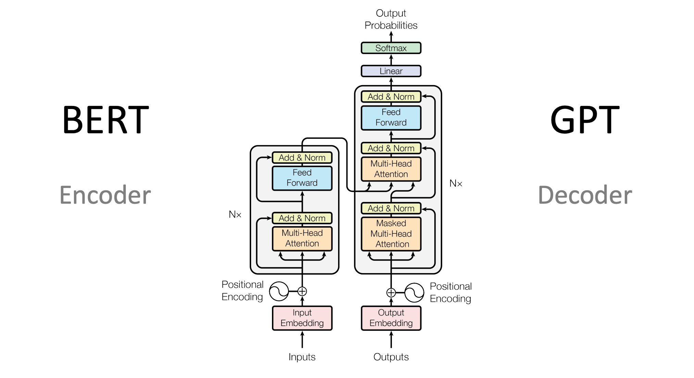

# Types of language models

## In the Transformers library, language models generally fall into three architectural categories:

    Encoder-only models (like BERT): These models use a bidirectional approach to understand context from both directions. They’re best suited for tasks that require deep understanding of text, such as classification, named entity recognition, and question answering.

    Decoder-only models (like GPT, Llama): These models process text from left to right and are particularly good at text generation tasks. They can complete sentences, write essays, or even generate code based on a prompt.

    Encoder-decoder models (like T5, BART): These models combine both approaches, using an encoder to understand the input and a decoder to generate output. They excel at sequence-to-sequence tasks like translation, summarization, and question answering.
    
    

# Key Performance Metrics

## When working with LLMs, four critical metrics will shape your implementation decisions:

    Time to First Token (TTFT): How quickly can you get the first response? This is crucial for user experience and is primarily affected by the prefill phase.
    Time Per Output Token (TPOT): How fast can you generate subsequent tokens? This determines the overall generation speed.
    Throughput: How many requests can you handle simultaneously? This affects scaling and cost efficiency.
    VRAM Usage: How much GPU memory do you need? This often becomes the primary constraint in real-world applications.

